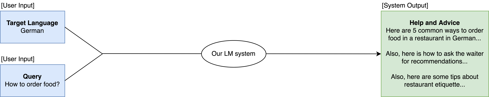
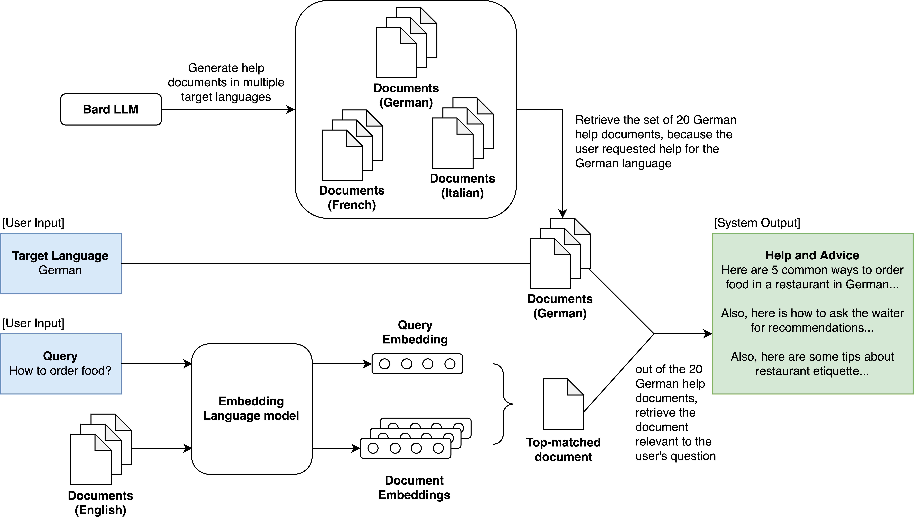
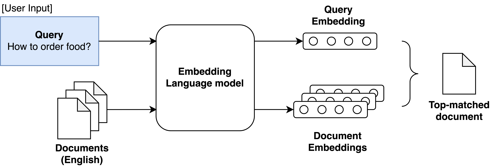
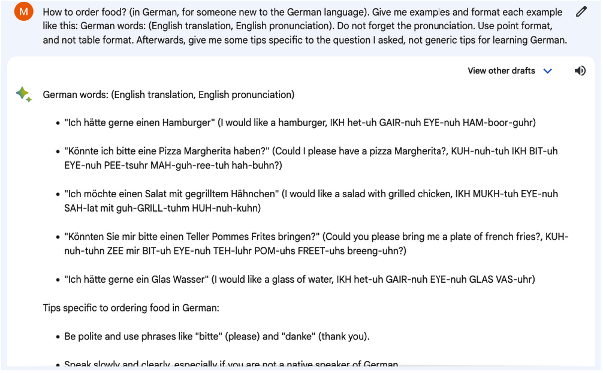
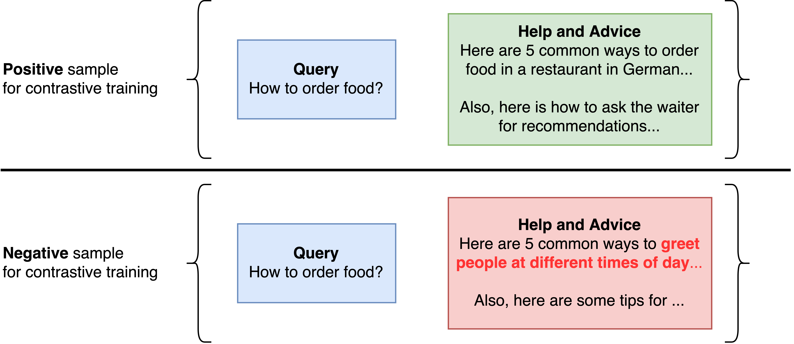

### Overview of the System

Our application provides real-time language assistance for users who are traveling in foreign countries. A user inputs the target language they need help with (e.g., German) and their specific query (e.g., “How to order food?”). Our system outputs examples of how to order food, with pronunciation tips, as well as tips for asking the waiter for recommendations, and additional tips about restaurant etiquette or other advice.

### Full Diagram of Overall Pipeline

Our system includes multiple parts: (A) Bard LLM to generate language help documents for 20 different scenarios in 5 different languages. (B) Embedding retrieval system that takes in a user’s query (e.g., “How to order food?”) and matches it to the most appropriate of the 20 scenarios. (C) Finally, the system uses the user’s input target language (e.g., German) to return the relevant help document, corresponding to the correct scenario and target language.

### Building the document retrieval pipeline and system (using Embedding LM)

We used an Embedding LM to match a user’s input query (e.g., “How to order food?”) to the corresponding scenario they were facing, in order to return the correct language help document (e.g., “Here are 5 common ways to order food in a restaurant in <target language>...”).

### Training data for the Embedding LM retrieval system

- Come up with 20 queries
- Get Bard to provide responses to the 20 queries
- Processing and cleaning of Bard responses
- Create 10 paraphrased versions for each of 20 queries, then save them

To build the dataset corpus of language help documents (20 scenarios, 5 languages), we queried the Google Bard LLM. Although the figure above shows the Bard UI, we actually used an API library, thus eliminating the manual cost of manually entering the queries and copying the response text. This ensures we can scale to more scenarios and languages in future.

### Fine-tuning the Embedding LM retrieval system
- Contrastive loss training
- Evaluating retrieval performance

We trained our embedding LM with contrastive training. Above are examples of positive and negative samples. In particular, we used a Triplet Loss function.

Training dataset includes samples of the input-output format: (query, language help document). Positive samples are generated by pairing a query with the correct language help document, whereas negative samples are generated by pairing a query with an incorrect language help document. Using the paraphrasing LM earlier (Section 2-1), we generated a total of 10 queries for each of the 20 classes (scenarios). For each class, there are 1 positive sample and 19 negative samples. This brings our dataset size to be 20*10*20  = 4000 training samples. 

We trained our embedding LM using triplet loss and adam optimizer, for 25 epochs. We used a small batch size of 4 to ensure no out-of-memory errors.

### Evaluations

|                                                                                                 | accuracy | f1-score |
|-------------------------------------------------------------------------------------------------|----------|----------|
| **Generic baselines for comparison**                                                            |          |          |
| Random baseline                                                                                 | 0.05     | 0.05     |
| **Sentence Transformers (trained for sentence similarity tasks and creating sentence embeddings)** |  | |
| bert-base-nli-mean-tokens                                                                       | 0.450    | 0.411    |
| msmarco-distilbert-dot-v5                                                                       | 0.875    | 0.850    |
| sentence-t5-base                                                                                | 0.925    | 0.907    |
| sentence-t5-large                                                                               | 0.925    | 0.907    |
| **Sentence Transformers (trained for semantic retrieval of <question, paragraph> pairs)**           |          |          |
| multi-qa-MiniLM-L6-cos-v1                                                                       | 0.900    | 0.867    |
| **Sentence Transformers (trained for semantic retrieval of <sentence, paragraph> pairs)**           |          |          |
| all-MiniLM-L6-v2                                                                                | 0.900    | 0.867    |
| all-mpnet-base-v2                                                                               | 0.950    | 0.933    |

Comparing the retrieval performance when using various models for semantic retrieval using <question, paragraph> pairs. An example of a query is “How do I order food?”, and an example of a retrieved paragraph is “Here is a basic overview of how to order food in a restaurant: 1. Greet the server…”.

Insights:
- Our semantic retrieval task involves <question, paragraph> pairs. Hence, it is surprising that the Sentence-Transformer model that is designed and trained for semantic retrieval of <question, paragraph> pairs, `multi-qa-MiniLM-L6-cos-v1`, performs worse than generic Sentence-Transformer models that were trained for semantic retrieval of <sentence, paragraph> pairs, such as `all-MiniLM-L6-v2` and `all-mpnet-base-v2`.
- Overall, our results show that `all-mpnet-base-v2`, the most downloaded Sentence-Transformer model on Hugging Face, performs the best when compared to the other Sentence-Transformer models and baselines we tested.
- Summary: For our retrieval system, we proceed with `all-mpnet-base-v2`
